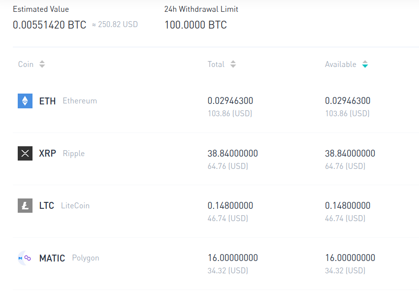

Family Fund - Voting 

i. Voting Value
ii.Personelle
iii. Procedure

I. Voting Value (vv)

All board members have Voting Value to exercise decision making.
The boards total VV are tallyed and averaged the funds investment 
pool is then distributed correlated tot he vv average.

A members voting value is obtained by two factors both of which are
meant to reflect experience with money and life overall.

1. First their standing overall in the nuclear family.
Patriachs/Matriarcs are valued 1 vv. A member is also then awarded 1/2 point
per child.  A patriach/matriach of their personal families is also awarde 1 point.  If a memeber has 0 vv they are awarded a single vv.

2. Should any member or members make a decision to invest more money at any point than what is decided on during the previous meeting
they are afforded a single TEMPORARY vv.  TEMP VV can be awarded based on monetary amounts, say 1/2 vv per 50$ over the decided upon amount 
this can be discussed and decided upon by the board at any time.

