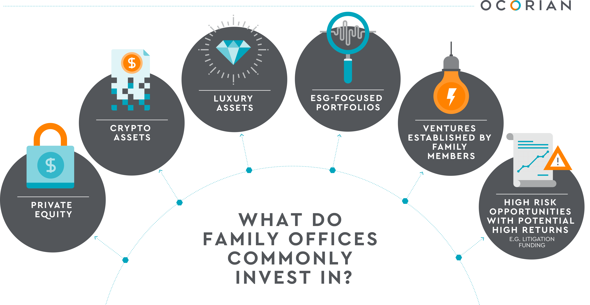
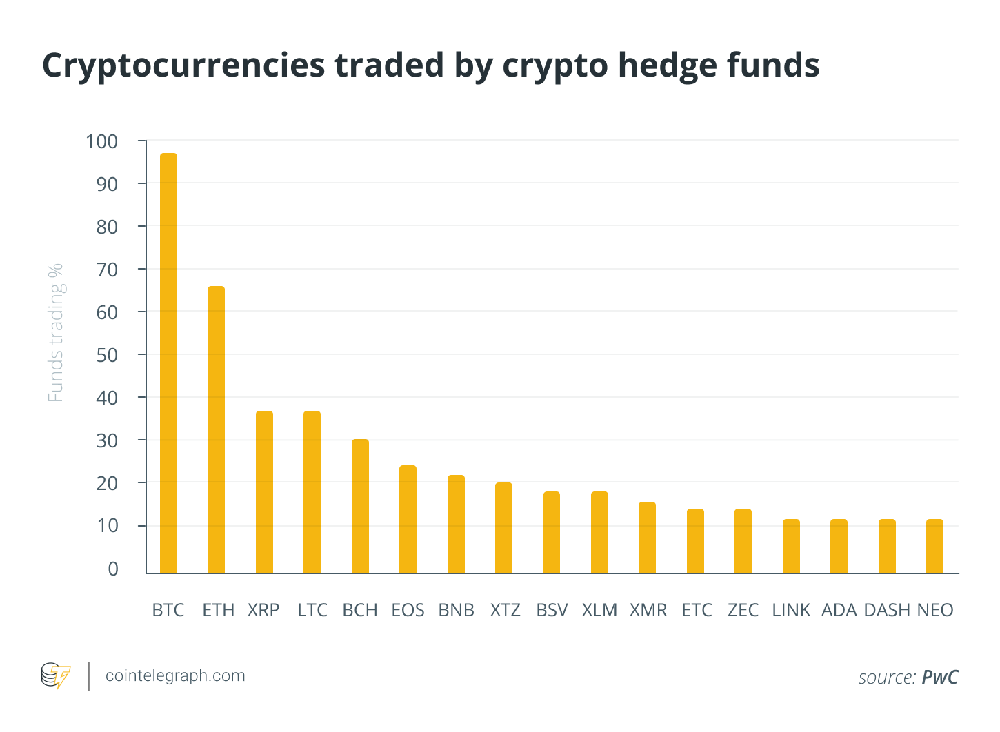
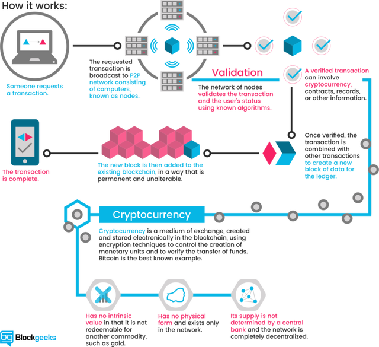

Family Fund - Voting 

i. Voting Value
ii.Personelle
iii. Procedure

I. Voting Value (vv)

All board members have Voting Value to exercise decision making.
The boards total VV are tallyed and averaged the funds investment 
pool is then distributed correlated tot he vv average.

A members voting value is obtained by two factors both of which are
meant to reflect experience with money and life overall.

1. First their standing overall in the nuclear family.
Patriachs/Matriarcs are valued 1 vv. A member is also then awarded 1/2 point
per child.  A patriach/matriach of their personal families is also awarde 1 point.  If a memeber has 0 vv they are awarded a single vv.

2. Should any member or members make a decision to invest more money at any point than what is decided on during the previous meeting
they are afforded a single TEMPORARY vv.  TEMP VV can be awarded based on monetary amounts, say 1/2 vv per 50$ over the decided upon amount 
this can be discussed and decided upon by the board at any time.

II. Positions at the Table

To keep things interesting and ordered everyone will have a position or job in the boardroom.

TREASURER - Single Member who has unlimited access to the funds wallets & applications.  Everyone reserves the right to at anytime check and make sure the wallet is up to date and in order but only the Treasurer's device will recieve the 2 Factor Authentication Codes.  So you'll need him or her to let you in.  This position is essenially our Chairmen/Chairwomen they will be expected to act in the groups best interest.

STEWARD - This member is given temporary Voting Value in the event that some kind of tie arises and needs to be broken.  They'll be picked in advanced so that the process is kept above bias'.

Keeper of the Minutes - Records all votes and major decisions made by the board.  Also they'll be expected to provide and prepare paperwork/emails should information arise specifically MEETING RELATED.

MARKETTING - This member is going to be expected to bring more of the family into the fund, or rather to get more family and friends excited about investing in a safe friendly atmosphere.  

CEO - Fund oriented tasks specifically dealing with wallets & apps at setup and maintainence. However the CEO nor anyone else will have unlimited access at anytime.  Informing the board of new avenues for investment (new coins, new opportunities within crypto ect.) Communicating and relaying informaiton to the board BEYOND THE MEETINGS AND IN BETWEEN whereas KEEPER deals with these things strictly during and around meeting time.  Contacting and keeping the board members informed and excited.  A weekly (probably more often) breakdown of how the fund is doing.

CFO - Few tasks but the CFO is extremely important, theyll be expected to make the financial decisions (buy,sell,trade,stake, ect.) in times of unexpected market gains and losses.  The CFO keeps the fund from going into the red during the downtime between meetings.  CFO & CEO should be in regular contact making sure the fund isnt taking losses that can be avoided (in over a year with close to 1000$ invested I have never lost more than 5$ in any trade or market movement, almost ALL losses can be avoided or mitigated easily)

What Are Cryptocurrencies and How Do They Work?

Cryptocurrency is based on blockchain technology. That's a chain of information registration and distribution that is not controlled by any single institution. Instead, it works as a record of digital transactions that are independent of central banks.

There are all kinds of technical details related to blockchain technology that may be worth investigating if it doesn't drive you into a technological coma. But essentially, it eliminates the middleman — such as a bank — and allows buyers and sellers to transact business directly between each other. That should also serve to lower or even eliminate transaction fees, which is a major part of the attraction of cryptocurrency.

The most popular cryptocurrency is Bitcoin, whose price is regularly tracked in the major financial media. But there are actually hundreds of cryptocurrencies, including many that have already come and gone.

What are the Main Attractions of Cryptocurrency

What you need to invest in bitcoinAt the moment, it seems as if the two primary attractions of cryptocurrency are:

    You can own and use it anonymously, and
    It's subject to price explosions that can make it look and feel like an investment.

And for those who bought cryptocurrency prior to the price explosion in 2017 or the most recent price increase in 2021, it's probably been the best investment in a lot of portfolios.

So what should you do if you want to get in on the cryptocurrency action?
